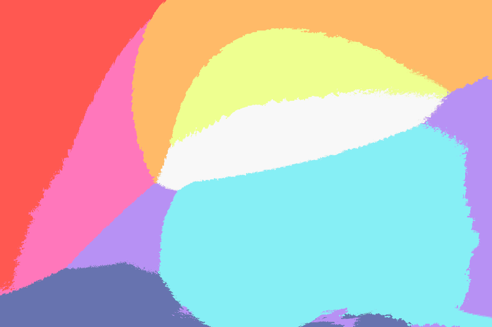
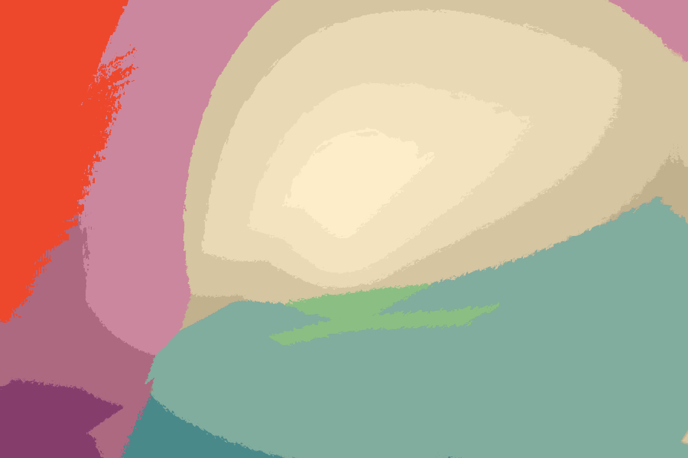
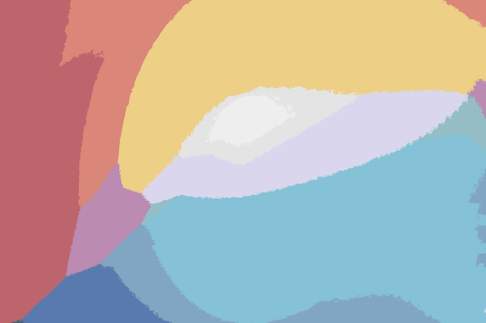

# Opal

Opal is a tool to change images color palette.

It supports png, jpeg, jpg, bmp, ico and gif (with no animations yet).

## Installing

Clone the repository:

```sh
git clone https://github.com/sixels/opal.git && cd opal
```

[Setup a rust environment](https://www.rust-lang.org/tools/install) then run:

```sh
cargo install --path .
```

## Usage

For now, Opal has only two positional arguments, the filename and the color scheme (it doesn't support multiple images at the same time).
You can run it as follow:

```sh
opal path/to/image (nord|gruvbox|oceanic|dracula)
```

## Preview

| Original Image | Dracula | Gruvbox | Nord |
| :------------: | :-----: | :-----: | :--: |
|  |  |  |  |
|  |  |  |  |
|  |  |  | |
|  |  |  | |

_All images were compressed **after** being generated_.

## TODO

- [ ] Refactoring
- [ ] Better CLI interface
- [ ] Add more color schemes
- [ ] Support custom color schemes
- [ ] Progress bar

## Images Attributions

All featured images were taken from [Unsplash](unsplash.com)

- [Colors](./assets/images/colors.jpg) by [Daniele Levis Pelusi](https://unsplash.com/@yogidan2012?utm_source=unsplash&utm_medium=referral&utm_content=creditCopyText)
- [Gradient](./assets/images/gradient.jpg) by [Gradienta](https://unsplash.com/@gradienta?utm_source=unsplash&utm_medium=referral&utm_content=creditCopyText)
- [Landscape](./assets/images/landscape.jpg) by [Robert Lukeman](https://unsplash.com/@robertlukeman?utm_source=unsplash&utm_medium=referral&utm_content=creditCopyText)
- [Forest](./assets/images/forest.jpg) by [Johannes Plenio](https://unsplash.com/@jplenio?utm_source=unsplash&utm_medium=referral&utm_content=creditCopyText)
